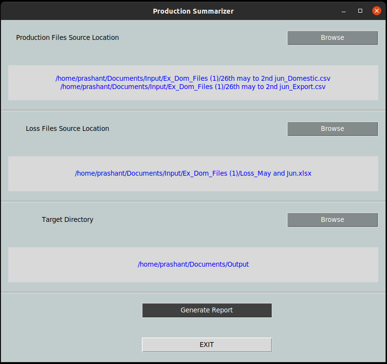

# Production Report Summarizer

I did this project for my dad. He wants to get the production info for each department so that he knows how efficiently
the lens are being produced. Sometimes, there are losses by one of the department and hence, the lens needs to be
reproduced by other departments as well. He wanted to analyze how much production is being done against the order and
which department is doing how much production and the effect of loss on overall production.

**Production Report Summarizer** is a desktop app that generates the report for two of the departments TS and DS. It is
based on state machine where the production count for the department gets incremented as it moves from one department to
other. The source and the destination states are configurable for the departments.

